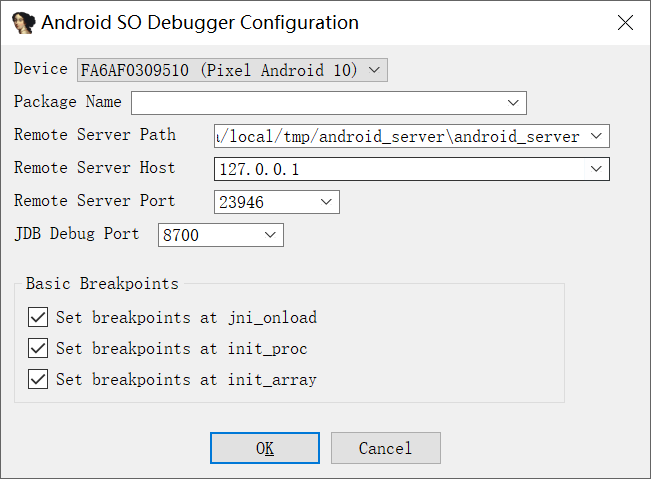

一个简单的 IDA 插件，简化 IDA 调试 Android 应用，目前可以在 IDA9.0 中使用。

# 要求

`adb` 和 `jdb` 在环境变量中，然后在IDA中设置 debuger 为 `Remote ARM Linux/Android debugger`，执行插件设置包名即可调试。
插件运行界面如下：

# 参考

https://topjohnwu.github.io/Magisk/tools.html

https://github.com/tiann/KernelSU

https://github.com/g2wfw/IDADebugHelper

